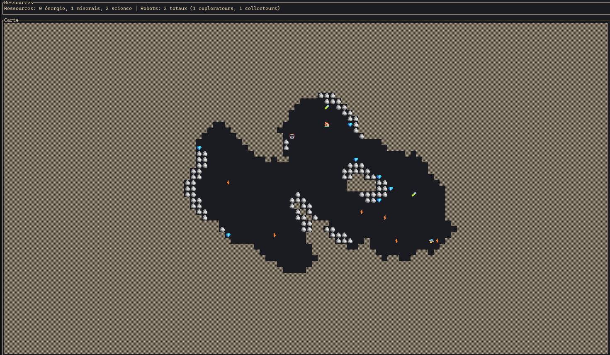

# Documentation du Projet Rust-EREEA

## Vue d'ensemble

Rust-EREEA est un jeu de simulation de gestion de ressources et d'exploration en temps réel qui se déroule dans un terminal. Le joueur gère une base qui déploie deux types de robots (explorateurs et collecteurs) pour explorer une carte générée procéduralement et collecter différentes ressources.

## Structure du projet

Le projet est organisé en plusieurs modules Rust, chacun ayant une responsabilité spécifique :

- **main.rs** : Point d'entrée du programme, initialise la simulation et gère la boucle principale
- **generation.rs** : Génération procédurale de la carte du monde
- **base.rs** : Gestion de la base et des ressources
- **robot.rs** : Comportement des robots explorateurs et collecteurs
- **pathfinding.rs** : Algorithmes de recherche de chemin pour les robots
- **ui.rs** : Interface utilisateur dans le terminal

## Fonctionnalités

### Génération de carte

La carte du monde est générée procéduralement à l'aide d'un algorithme de bruit de Perlin. Elle contient différents types d'éléments :

- **Vide** : Cases traversables
- **Mur** : Obstacles infranchissables
- **Base** : Point central des opérations
- **Ressources** : Énergie, Minerais, Science
- **Robots** : Explorateurs et Collecteurs

La génération peut être personnalisée avec une graine (seed) spécifique passée en argument lors du lancement du programme.

### Types de ressources

Le jeu comporte trois types de ressources essentielles :

1. **Énergie** (⚡) : Utilisée pour alimenter les opérations
2. **Minerais** (💎) : Matières premières pour la construction
3. **Science** (🧪) : Développement technologique

### Types de robots

Deux types de robots peuvent être déployés depuis la base :

1. **Explorateurs** (🛸) : Découvrent la carte et révèlent les ressources
   - Se déplacent aléatoirement avec une préférence pour les zones inexplorées
   - Coût : 4 Science, 3 Minerais, 2 Énergie

2. **Collecteurs** (🤖) : Récupèrent les ressources et les ramènent à la base
   - Utilisent un algorithme de recherche de chemin pour atteindre les ressources
   - Coût : 1 Science, 5 Minerais, 4 Énergie

### Système de base

La base est le centre d'opérations. Elle :
- Stocke les ressources collectées
- Gère la production de nouveaux robots
- Maintient un ratio optimal entre explorateurs et collecteurs (environ 1:2)
- Priorise les ressources à collecter en fonction des besoins

### Algorithme de pathfinding

Les robots collecteurs utilisent l'algorithme A* pour trouver le chemin optimal vers les ressources et revenir à la base. Cet algorithme prend en compte :
- La distance de Manhattan
- Les obstacles (murs)
- Les zones inexplorées

## Implémentation technique

### Concurrence et multithreading

Le jeu utilise extensivement les fonctionnalités de concurrence de Rust :
- Chaque robot s'exécute dans son propre thread
- La base gère ses opérations dans un thread dédié
- Les ressources partagées sont protégées par des `Mutex` et encapsulées dans des `Arc` (Atomic Reference Counting)

### Prioritisation des ressources

Le système utilise une file de priorité (`BinaryHeap`) pour déterminer quelles ressources collecter en priorité, basé sur :
- Le type de ressource dont la base manque le plus
- La distance à la ressource
- L'accessibilité de la ressource

### Interface utilisateur

L'interface utilisateur est construite avec la bibliothèque ratatui et crossterm, permettant :
- Affichage de la carte en temps réel avec des symboles Unicode
- Affichage des statistiques des ressources
- Visualisation des robots sur la carte

## Comment jouer

1. **Installation** : Assurez-vous d'avoir Rust et Cargo installés
2. **Lancement** : Exécutez `cargo run` dans le dossier du projet
3. **Options** : Vous pouvez spécifier une graine pour la génération de la carte avec `cargo run seed=42`

La taille de la carte s'adapte automatiquement à la taille de votre terminal.

## Légende des symboles

Voici les différents éléments présents sur la carte :
- Vide : "  " (espace vide)
- Mur : 🪨
- Base : 🏠
- Énergie : ⚡
- Minerais : 💎
- Science : 🧪
- Explorateur : 🛸
- Collecteur : 🤖
- Inconnu : ▒▒

## Stratégie de jeu

- Les explorateurs révèlent la carte progressivement
- Les collecteurs récupèrent les ressources en priorisant celles dont vous manquez
- La base gère automatiquement la production de nouveaux robots
- Maintenez un équilibre entre exploration et collection pour une progression optimale

## Limitations et améliorations possibles

- **Performance** : Optimisation pour les grandes cartes
- **Interface** : Ajout de commandes utilisateur pour plus d'interaction

## Conclusion

Rust-EREEA est une démonstration impressionnante de la programmation concurrente en Rust, avec une simulation de gestion de ressources fonctionnant entièrement dans un terminal. Le projet illustre plusieurs concepts avancés comme la gestion des threads, la protection des données partagées et l'intelligence artificielle pour la prise de décision des robots.